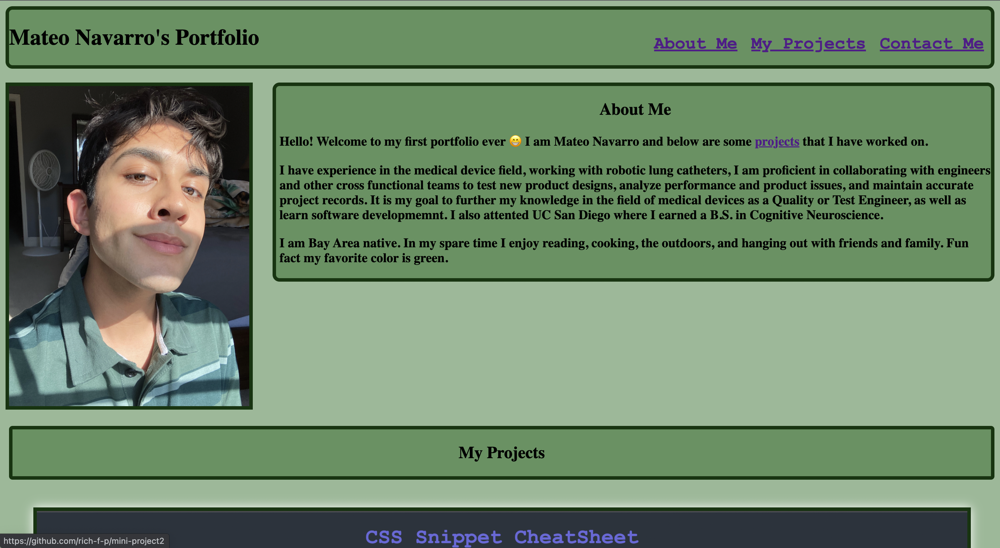

# My First Portfolio

## Description

Portfolio built and designed using HTML and CSS. Webpage incudes an image of myself, an about me section, past projects, and my contact info. Intended to showcase my experience, work, and more about myself.

## Visuals

## Usage

Navigation links in the upper right corner. Each one will take you to the corresponding section of the webpage. "About Me" section includes a description of my previous work and education experience. "My Projects" includes a gallery of past projects. Clicking an image in this section will take you to its corresponding webpage in which you can view the project. The final section is labelled "Contact Me!". Here you can find my phone number, email, as well as links to my GitHub and LinkeIn.

## Links

1. https://mateonav98.github.io/my-first-portfolio/
2. https://github.com/mateonav98/my-first-portfolio

## Code

HTML
CSS

## Authors

Mateo Navarro